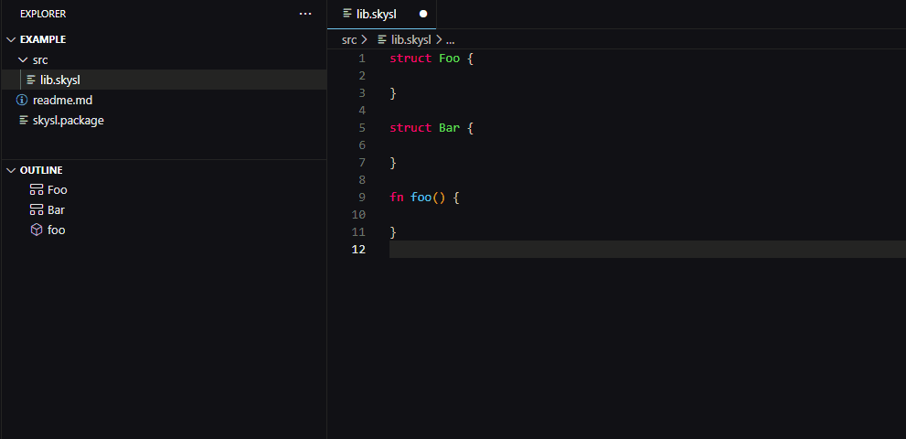

# sky-sl

🚧 work in progress 🚧

A rusty shading language experiment.

## scope

The project, at least for now, is just an experiment

### goals

* SPIR-V output (at first via glsl and shaderc)
* VScode integration via Language Server Protocol, similar to rust-analyzer
* Compiler as a library to integrate with asset systems
* CLI to:
  * build all shaders in a package
* A workspace API to:
  * Query shaders and data layouts
  * Create code fragments (either source code, or emit some IR, depends on what has better UX)
* Some sort of integration with regular rust code, to add some type safety between CPU and GPU data types

### maybe-goals

* WGSL output
* output compatibility with [naga](https://github.com/gfx-rs/naga) if the project gets more serious

### non-goals

* Optimizing compiler (we'll rely on SPIR-V tools)

## language server

Currently only runs in VSCode extension development environment and lacks any build process to generate an extension.

### working features

* Outline
* Semantic highlighting ([must be enabled in your theme](https://code.visualstudio.com/api/language-extensions/semantic-highlight-guide#enablement-of-semantic-highlighting))

## license

sky-sl and its components is primarily distributed under the terms of both the MIT license and the Apache License (Version 2.0).

See [LICENSE-APACHE](LICENSE-APACHE) and [LICENSE-MIT](LICENSE-MIT) for details.
